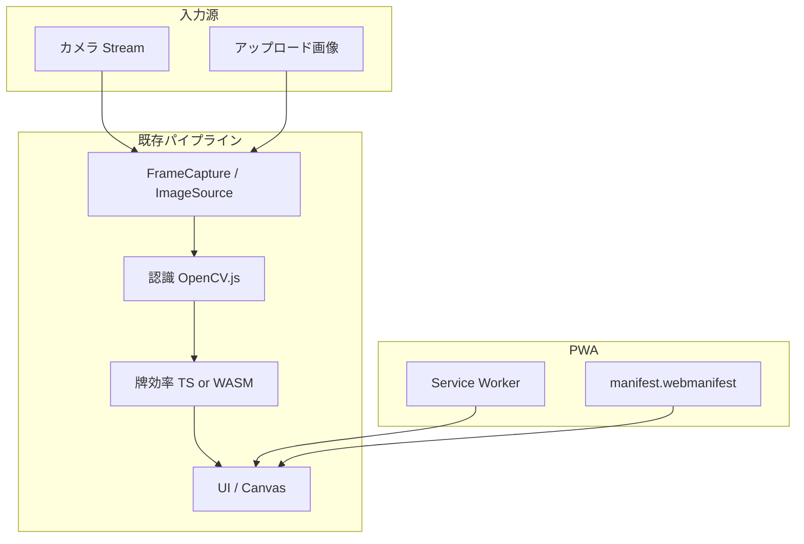

# Design: 入力強化・WASM・PWA

## Context

JanCame MVP はカメラ → 認識 → 牌効率（TS）→ UI の構成。本 change では入力源の拡張、牌効率の WASM 化、PWA 対応を行う。



## Goals / Non-Goals

**Goals:**

- カメラストリームをユーザー操作で ON/OFF できる
- 静止画アップロードでカメラなしテストができる
- 牌効率計算を Rust WASM で提供し、既存 TS 実装と結果一致をテストで担保
- GitHub Pages 上で PWA としてインストール可能

**Non-Goals:**

- 動画アップロード、OpenCV WASM 化、オフライン認識

## Decisions

### Decision 1: 入力モードは `camera` | `image` の2値

**選択**: 排他的な入力モード。画像モード時はカメラストリームを停止する。

**理由**: フレームソースを単一化し、FrameCapture の実装を共通化できる。

### Decision 2: カメラ ON/OFF と認識 ON/OFF を分離

| 操作 | 効果 |
|------|------|
| カメラ OFF | ストリーム停止、プレビュー非表示（またはプレースホルダ） |
| 認識 OFF | プレビューは継続、認識パイプラインのみ停止 |

**理由**: MVP の認識トグルは維持しつつ、省電力・プライバシー用にストリーム制御を追加。

### Decision 3: Rust + wasm-pack で牌効率 WASM

**選択**: `crates/tile-efficiency-wasm/` を新設。`wasm-bindgen` で JS API を公開。

**TS フォールバック**: WASM 読み込み失敗時は既存 TS モジュールを使用。

**理由**: Phase 2 計画どおり。ビット演算・全探索の高速化と将来拡張性。

### Decision 4: vite-plugin-pwa で PWA

**選択**: `vite-plugin-pwa`（Workbox）で Service Worker と manifest を生成。

**キャッシュ方針**:

- **precache**: HTML, JS, CSS, manifest, アイコン
- **runtime**: OpenCV.js CDN（network-first、オプション）
- **network-only**: カメラ API（対象外）

**理由**: Vite エコシステムと GitHub Pages 静的ホスティングに適合。

### Decision 5: GitHub Pages base path との整合

PWA manifest の `start_url` / `scope` は `/JanCame/` を使用。Service Worker の `scope` も同様。

## モジュール設計

### 入力ソース抽象化

```typescript
interface FrameSource {
  readonly mode: 'camera' | 'image';
  start(): Promise<void>;
  stop(): void;
  getFrameCanvas(): HTMLCanvasElement; // video 描画 or 静止画
  getDimensions(): { width: number; height: number };
}
```

### WASM API（案）

```typescript
interface WasmEfficiencyModule {
  calcShanten(tiles: TileId[]): number;
  calcEfficiency(tiles: TileId[]): EfficiencyResult;
}
```

### UI 追加要素

```
Header:
  [カメラ ON/OFF]  [認識 ON/OFF]  [画像を選択…]
  入力: カメラ | 画像: hand-test.jpg
```

## ディレクトリ構成（追加分）

```
crates/tile-efficiency-wasm/
├── Cargo.toml
└── src/lib.rs
src/
├── input/
│   ├── frame-source.ts
│   ├── camera-source.ts
│   └── image-source.ts
├── efficiency/
│   └── wasm-loader.ts
public/
├── manifest.webmanifest  # または vite-plugin-pwa が生成
└── icons/
```

## CI 変更

```yaml
- rustup + wasm32-unknown-unknown
- wasm-pack build crates/tile-efficiency-wasm
- pnpm build（WASM 成果物を public/ または src/ にコピー）
```

## Risks / Trade-offs

| リスク | 対策 |
|--------|------|
| WASM と TS の計算結果不一致 | 同一 fixture で両方テスト |
| PWA + GitHub Pages の scope 問題 | base `/JanCame/` で manifest/SW を統一 |
| 画像モードで ROI 座標がずれる | getDimensions() で quad を再計算 |
| CI ビルド時間増 | Rust キャッシュ（actions/cache） |

## 実装フェーズ

| Phase | 内容 |
|-------|------|
| 1 | カメラ ON/OFF + 入力抽象化 |
| 2 | 画像アップロード入力 |
| 3 | Rust WASM 牌効率 + テスト |
| 4 | PWA（manifest + SW + アイコン） |
