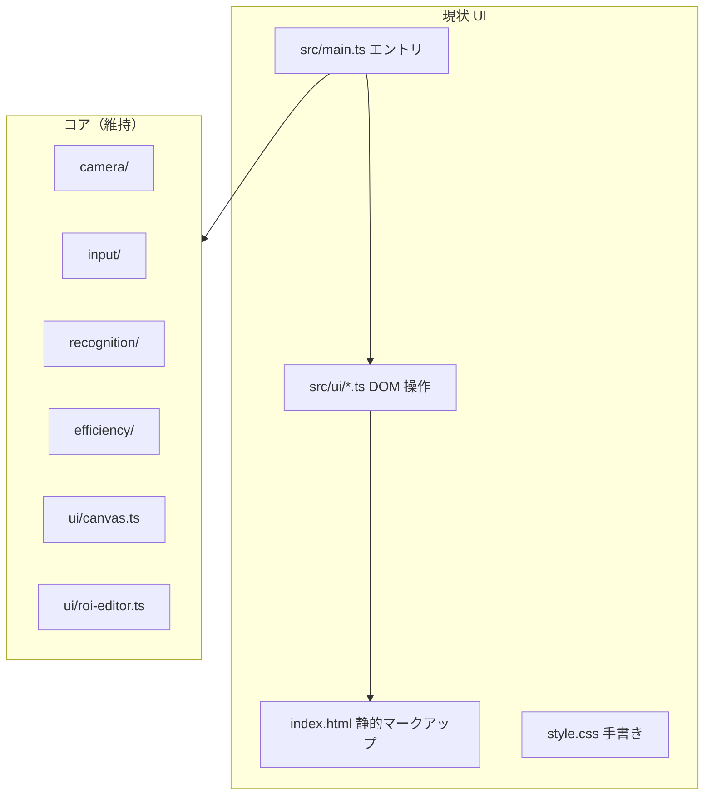
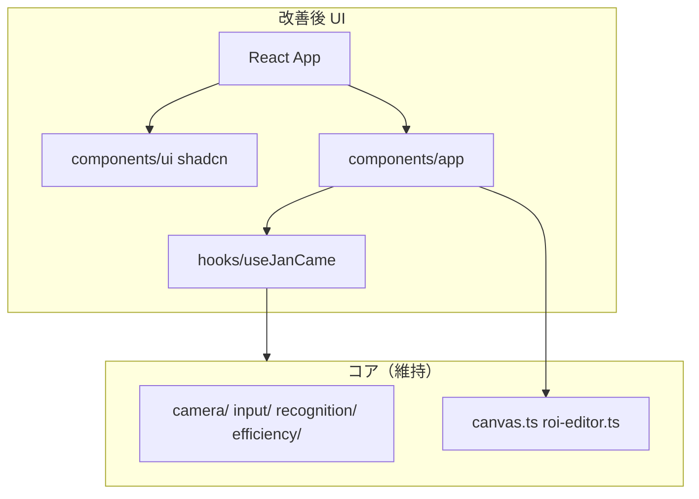

# Design: shadcn/ui による UI 刷新

## Context

現状のアーキテクチャ:



shadcn/ui は **React + Tailwind CSS** 前提。UI 層のみ React 化し、コアロジックは既存 TypeScript モジュールをそのまま import するハイブリッド構成とする。



## Goals / Non-Goals

**Goals:**

- shadcn/ui コンポーネントでヘッダー・パネル・補正・ローディング・エラーを統一デザインに刷新
- モバイル縦画面を主としたレスポンシブレイアウトを Tailwind で再実装
- 既存機能（カメラ ON/OFF、認識 ON/OFF、画像アップロード、手動補正、牌効率表示）をすべて維持
- Biome lint / Vitest / GitHub Pages ビルドを壊さない

**Non-Goals:**

- 全コードベースの React 化
- Canvas 描画ロジックの変更
- 新機能追加（設定画面等は将来 change）

## Decisions

### Decision 1: UI 層のみ React 化（ハイブリッド）

**選択**: `src/main.tsx` で React をマウント。`useJanCame` フックが既存の `InputManager`, `RecognitionWorkerClient`, `initEfficiencyEngine` 等をラップし、状態を React に橋渡しする。

**理由**: 認識・WASM・Worker は安定した非 React モジュール。UI だけ React 化すれば移行リスクを最小化できる。

**代替案**: Preact + 互換レイヤー — shadcn 公式サポートが React 向けのため不採用。

### Decision 2: shadcn/ui + Tailwind CSS v4（Vite 統合）

**選択**:

1. `pnpm dlx shadcn@latest init` で `components.json` 生成
2. スタイル: **New York** スタイル、ベースカラー **Zinc**、ダークテーマ固定
3. CSS 変数で麻雀テーマのアクセント（赤＝切、黄＝低信頼、緑＝牌面）を `--accent` / カスタムトークンで定義

**採用コンポーネント（初期）**:

| 用途 | shadcn コンポーネント |
|------|----------------------|
| ヘッダートグル | `Switch`, `Label` |
| ボタン | `Button` |
| 入力モード表示 | `Badge` |
| 牌効率パネル | `Card`, `CardHeader`, `CardContent`, `ScrollArea` |
| 打牌候補リスト | `Badge`, `Separator` |
| 手動補正スロット | `Button` (variant outline) |
| 牌ピッカー | `Sheet` または `Dialog` + `Button` grid |
| ローディング | カスタムスピナー + `Skeleton` |
| エラー / オフライン | `Alert`, `AlertDescription` |
| デバッグメトリクス | `Card` (compact) |

### Decision 3: レイアウト構成

**選択**:

```
┌─────────────────────────────────────┐
│ AppHeader (shadcn)                  │
│  Logo | Badge(入力) | Switch×2 | Btn │
├──────────────────┬──────────────────┤
│ CameraViewport   │ SidePanel        │
│  video/canvas    │  EfficiencyCard  │
│  ROI editor      │  CorrectionCard  │
│  Loading/Alert   │  DebugCard(?debug)│
└──────────────────┴──────────────────┘
```

- モバイル: `flex-col` — カメラ上、パネル下（現状維持）
- `md:` 以上: `flex-row` — カメラ左、パネル右

### Decision 4: Canvas / ROI は ref ラッパー

**選択**: `CameraViewport.tsx` が `<video>`, `<canvas>`, ROI コンテナへの ref を保持。`OverlayRenderer` と `RoiEditor` は既存クラスを ref 接続後に初期化。

```typescript
interface CameraViewportHandle {
  videoRef: RefObject<HTMLVideoElement>;
  previewCanvasRef: RefObject<HTMLCanvasElement>;
  overlayCanvasRef: RefObject<HTMLCanvasElement>;
  roiContainerRef: RefObject<HTMLDivElement>;
}
```

**理由**: Canvas 2D 描画と ROI ドラッグは実績のある既存実装を維持。

### Decision 5: 旧 UI モジュールの廃止順

1. `controls.ts` → `AppHeader.tsx`
2. `panel.ts` → `EfficiencyPanel.tsx`
3. `correction.ts` → `CorrectionPanel.tsx`
4. `debug-metrics.ts` → `DebugMetricsCard.tsx`
5. `style.css` の UI 部分削除 → `src/index.css`（Tailwind + shadcn 変数）

## モジュール間インターフェース

```typescript
// hooks/useJanCame.ts — React ↔ コアの橋渡し
interface JanCameState {
  inputMode: 'camera' | 'image';
  inputFileName: string | null;
  cameraEnabled: boolean;
  recognitionEnabled: boolean;
  loading: boolean;
  loadingMessage: string;
  cameraError: string | null;
  offline: boolean;
  recognition: RecognitionResult | null;
  efficiency: EfficiencyResult | null;
  efficiencyError: string | null;
  debugMetrics: RecognitionMetrics | null;
  controlsEnabled: boolean;
}

interface JanCameActions {
  setCameraEnabled: (enabled: boolean) => void;
  setRecognitionEnabled: (enabled: boolean) => void;
  selectImage: (file: File) => void;
  clearImage: () => void;
  correctTile: (index: number, tileId: TileId) => void;
  retryCamera: () => void;
  setRoiQuad: (quad: RoiQuad) => void;
}
```

## テーマ方針

| 要素 | 方針 |
|------|------|
| ベース | shadcn dark + zinc |
| 背景 | `bg-background` 系、カメラ領域は `bg-muted` |
| アクセント赤 | 切マーク・重要アクション（`destructive` 活用） |
| アクセント黄 | 低信頼スロット（Canvas 側は既存色維持、UI 枠は `border-yellow-500`） |
| 牌ラベル | `font-mono` + `Badge` 風 |

## Risks / Trade-offs

| リスク | 対策 |
|--------|------|
| バンドルサイズ増（React + Radix） | 使うコンポーネントのみ追加、tree-shaking |
| 移行中の機能退行 | Phase ごとに手動スモークテスト、既存 Vitest 維持 |
| `main.ts` 肥大化の React 移行 | `useJanCame` にロジック集約 |
| GitHub Pages base path | Vite `base` 設定維持、shadcn アセットパス確認 |
| Biome と JSX | `biome.json` に React サポート確認 |

## 未決定事項（実装時デフォルト）

| 項目 | デフォルト |
|------|-----------|
| 牌ピッカー | モバイルは `Sheet`、デスクトップは `Dialog` |
| アイコン | `lucide-react`（Camera, Upload, Power, Scan 等） |
| フォント | システムフォント + shadcn デフォルト |
| PWA theme-color | `#09090b`（zinc-950 相当）に更新 |
