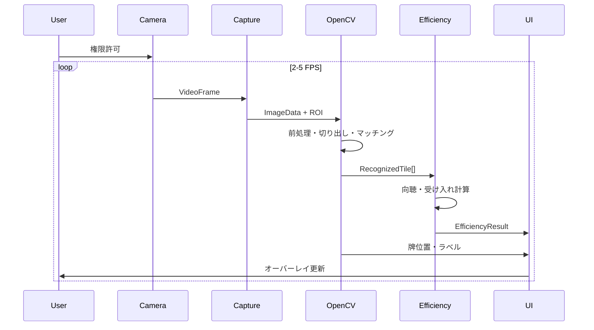

# Design: JanCame MVP

## Context

JanCame はサーバーレス構成の SPA として、ブラウザ内で完結する麻雀手牌認識・牌効率計算アプリである。カメラ映像 → 画像認識 → 牌効率計算 → UI 描画の4層パイプラインで構成する。

```mermaid
flowchart TB
    subgraph Browser["ブラウザ (SPA)"]
        CAM[Webカメラ Stream]
        CAP[フレームキャプチャ 2-5 FPS]
        CV[tile-recognition<br/>OpenCV.js]
        EFF[tile-efficiency<br/>TypeScript]
        UI[ui-overlay<br/>Canvas + DOM]
        ASSETS[テンプレート 34種]
    end

    CAM --> CAP --> CV
    ASSETS --> CV
    CV -->|RecognizedTile[]| EFF
    EFF -->|EfficiencyResult| UI
    CV -->|牌位置・ラベル| UI
    CAM --> UI
```

## Goals / Non-Goals

**Goals:**

- カメラ映像から最大14枚の手牌を認識し、向聴数と打牌候補をリアルタイム表示する
- 静的ホスティングのみで動作する（バックエンド不要）
- スマホでも実用可能な FPS・処理時間を維持する
- 牌効率モジュールはユニットテストで検証可能にする

**Non-Goals:**

- 他家の捨て牌・河・ドラ表示の認識
- 役・打点・期待値（EV）計算
- 鳴き（チー・ポン・カン）状態の牌効率
- サーバー側推論・ユーザー認証
- MVP での WASM 化（Phase 2 以降）

## Decisions

### Decision 1: Vite + TypeScript SPA

**選択**: Vite + TypeScript、Canvas 2D + 軽量 DOM パネル

**理由**: 静的ビルドが容易、HMR で開発効率が高い。フレームワーク不要で OpenCV.js との統合がシンプル。

**代替案**: React — MVP では DOM 更新が少なく、オーバーヘッドを避けるため不採用。

### Decision 2: OpenCV.js + テンプレートマッチング

**選択**: OpenCV.js 4.x、`matchTemplate` による 34種牌識別

**理由**: 初回ロードは重いが DL より軽量。静的アセット（テンプレート画像）のみで完結。隙間時間開発に適する。

**代替案**: ORB 特徴点マッチング — 精度不足時の Phase 1.5 改善候補として保留。

### Decision 3: 手牌領域は手動 ROI + 自動補正

**選択**: ユーザーが画面上の枠を合わせ、OpenCV でパース補正・等幅分割

**理由**: 完全自動検出は照明・背景依存が強く MVP 実装コストが高い。手動 ROI で認識精度のベースラインを確保。

### Decision 4: 牌効率は Phase 1 TypeScript、Phase 2 WASM

**選択**: MVP は TypeScript 純粋実装。性能不足時に Rust + wasm-pack で置き換え。

**理由**: 14枚程度の探索は TS でも十分。先に正確性をユニットテストで担保し、後から最適化。

### Decision 5: 処理パイプラインの FPS 制限

**選択**: 2〜5 FPS でフレーム間引き。タブ非表示時は処理停止。

**理由**: スマホの発熱・バッテリー消費を抑える。牌効率計算は牌配列が変わった時のみ再実行。

## モジュール間インターフェース

```typescript
type TileId =
  | `${1 | 2 | 3 | 4 | 5 | 6 | 7 | 8 | 9}${'m' | 'p' | 's'}`
  | 'E' | 'S' | 'W' | 'N' | 'P' | 'F' | 'C';

interface RecognizedTile {
  id: TileId;
  confidence: number;
  boundingBox: { x: number; y: number; w: number; h: number };
}

interface RecognitionResult {
  tiles: RecognizedTile[];
  timestamp: number;
  frameId: number;
}

interface DiscardCandidate {
  tile: TileId;
  shantenAfter: number;
  ukeireTiles: TileId[];
  ukeireCount: number;
}

interface EfficiencyResult {
  shanten: number;
  candidates: DiscardCandidate[];
}
```

## ディレクトリ構成（想定）

```
src/
├── main.ts
├── camera/           # getUserMedia, フレームキャプチャ
├── recognition/      # OpenCV.js パイプライン
├── efficiency/       # 向聴・受け入れ計算
├── ui/               # Canvas オーバーレイ, パネル
└── types/            # 共有型定義
public/
└── assets/tiles/     # 34種テンプレート PNG
tests/
└── efficiency/       # 牌効率ユニットテスト
```

## 処理シーケンス



## Risks / Trade-offs

| リスク | 対策 |
|--------|------|
| 照明・反射で識別率低下 | 手動補正 UI、テンプレート複数バリエーション |
| OpenCV.js 初回ロード 5MB+ | 遅延ロード + ローディング UI |
| スマホ発熱 | FPS 制限、Worker 分離（Phase 1.5） |
| 同種4枚の分割ミス | 等幅分割 + 輪郭数検証 |
| 牌効率計算バグ | 既知手牌10件以上の回帰テスト |

## 未決定事項（実装前にデフォルト値を使用）

| 項目 | MVP デフォルト |
|------|----------------|
| 13枚 vs 14枚 | 14枚（ツモ後）のみ。13枚は手動補正で対応 |
| 残り枚数 | 各牌4枚固定（河・他家未考慮） |
| 七対子 | 向聴計算に含める |
| テンプレート素材 | 実牌を一定条件で撮影して生成 |
