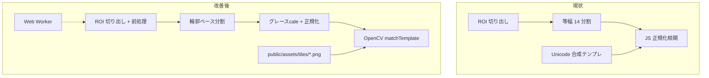
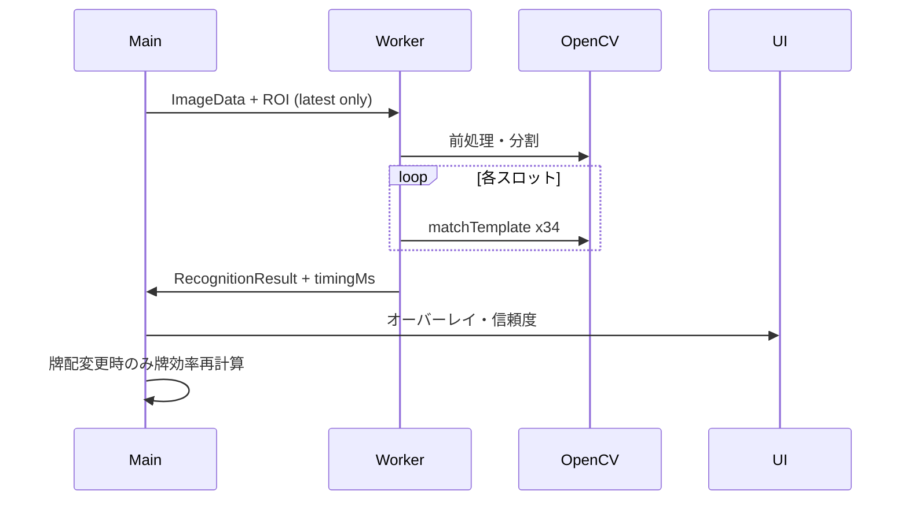

# Design: 牌認識の高精度化・高速化

## Context

現状の認識パイプラインは MVP スケルトンとして動作するが、テンプレートが Canvas 描画の Unicode 文字であり、マッチングも JS 相関のみ。OpenCV は輪郭数推定にしか使っていない。



## Goals / Non-Goals

**Goals:**

- 正面〜軽度傾きの実牌手牌で、14 スロット中 **10 枚以上** を自動認識（テスト fixture 基準）
- 1 フレーム処理 **500 ms 以内**（中級スマホ想定、Worker 内）
- テンプレート PNG 34 枚をリポジトリに同梱し、追加設定なしで改善効果を得る
- 低信頼スロットを UI で明示し、手動補正を 1〜2 タップで完了できる

**Non-Goals:**

- 任意の牌セット（牌霊等）への自動適応 — 同梱テンプレ + 将来のキャリブレーション script のみ
- 13 枚 / 鳴き / 副露形の自動検出

## Decisions

### Decision 1: テンプレートはリポ同梱 PNG + 生成スクリプト

**選択**:

1. **同梱**: `scripts/generate-tile-templates.mjs` で麻雀牌風 SVG/Canvas 描画から 34 枚 PNG を生成し `public/assets/tiles/` にコミット
2. **ロード**: `loadTileTemplates()` は PNG 優先、欠損時のみ現行の合成テンプレにフォールバック
3. **拡張**: README に「自分の牌を 1 枚ずつ撮影 → script で正規化」の手順を記載（任意）

**理由**: `/opsx:apply` 段階でテンプレート画像の用意まで実施可能。実牌写真は環境依存のため、まず**牌面デザインが物理牌に近い同梱 PNG**でベースラインを確立し、ユーザー独自素材は script で差し替え可能にする。

**代替案**: ユーザー初回キャリブレーションのみ — 初回 UX が重いため Phase 2 候補。

### Decision 2: OpenCV.js `matchTemplate` + TM_CCOEFF_NORMED

**選択**: 各スロット画像をテンプレートサイズにリサイズ後、OpenCV `matchTemplate` で 34 種を走査。最高スコアが閾値以上なら採用。

**前処理**:

- ROI / スロットをグレースケール化
- ヒストグラム均等化（`equalizeHist`）で照明差を吸収
- テンプレート Mat は初回ロード時にキャッシュ

**閾値**: 初期 `0.72`（CCOEFF_NORMED）。fixture テストで調整可能に `MATCH_THRESHOLD` 定数化。

**理由**: MVP design で本来想定していた方式。JS 相関より OpenCV 実装の方が速く精度も出やすい。

### Decision 3: 牌分割 — 輪郭優先、等幅フォールバック

**選択**:

1. Canny + findContours で ROI 内の牌候補矩形を抽出
2. アスペクト比・面積・Y 位置でフィルタし、左から最大 14 個を採用
3. 13〜14 個検出できない場合は現行の等幅分割にフォールバック

**理由**: 等幅のみでは牌間隔・枚数ズレに弱い。OpenCV は既にロード済み。

### Decision 4: 認識パイプラインを Web Worker へ移動

**選択**: `recognition.worker.ts` が `ImageData` + `RoiQuad` を受け取り `RecognitionResult` を返す。メインスレッドは最新リクエストのみ処理（古いフレームは drop）。

**理由**: matchTemplate × 34 × 14 はメインスレッドをブロックし UI がカクつく。FPS 3 でも Worker 化で体験が改善。

### Decision 5: UX — 信頼度と低信頼強調

**選択**:

- オーバーレイに信頼度 `%` 表示（認識成功時）
- 信頼度 < 閾値のスロットは黄色枠 + `?`
- 補正パネル: スロットタップで牌選択ポップアップ（34 種グリッド）

## モジュール間インターフェース

```typescript
interface TileTemplate {
  id: TileId;
  image: ImageBitmap | HTMLCanvasElement;
  mat?: cv.Mat; // OpenCV キャッシュ（Worker 内）
  source: 'asset' | 'generated';
}

interface MatchResult {
  id: TileId | null;
  confidence: number; // 0..1
  method: 'opencv' | 'fallback';
}

interface RecognitionWorkerRequest {
  frameId: number;
  imageData: ImageData;
  quad: RoiQuad;
}

interface RecognitionWorkerResponse {
  frameId: number;
  result: RecognitionResult;
  timingMs: number;
}
```

## テンプレートアセット仕様

| 項目 | 値 |
|------|-----|
| パス | `public/assets/tiles/{id}.png` |
| 命名 | `1m.png` … `9m.png`, `1p`…`9p`, `1s`…`9s`, `E,S,W,N,P,F,C.png` |
| サイズ | 48×64 px（テンプレート基準、マッチ前にスロットをリサイズ） |
| 生成 | `pnpm generate:templates` → script が PNG を再生成 |

## 処理シーケンス（改善後）



## Risks / Trade-offs

| リスク | 対策 |
|--------|------|
| 同梱 PNG と実牌の牌面デザイン差 | ヒストグラム均等化 + 閾値調整 + 手動補正 UX |
| OpenCV Worker で cv が二重ロード | Worker 内のみ OpenCV 初期化、メインは roi 描画のみ |
| Worker 転送コスト | ImageData は ROI クロップ後のみ送る |
| テスト fixture の保守 | 合成 fixture 3 手 + 1 実写相当 PNG を最小セット |

## 未決定事項（実装時デフォルト）

| 項目 | デフォルト |
|------|-----------|
| Worker 未対応環境 | メインスレッドフォールバック |
| テンプレート再生成 | CI では生成済み PNG を使用（script は開発用） |
| 13 枚手牌 | 14 スロットのうち未使用は `?`、手動補正で削除不可（MVP 維持） |
