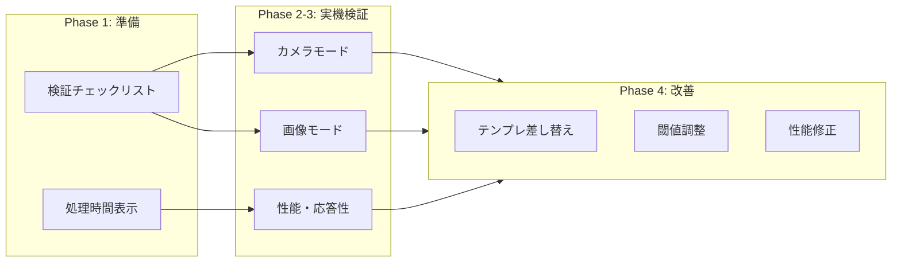

# Design: 牌認識の実機検証と改善

## Context

`improve-tile-recognition` で以下は完了済み:

- PNG テンプレート 34 枚 + OpenCV `matchTemplate`
- 輪郭ベース分割 + 等幅フォールバック
- Web Worker 分離
- 信頼度表示・手動補正 UX
- 自動テスト（合成 fixture で 10/14 以上）

未検証の受け入れ基準（アーカイブ時の 7.1 / 7.2）:

| 項目 | 基準 |
|------|------|
| 7.1 認識率 | カメラ / 画像モードで実牌 14 枚手牌のうち **10 枚以上** 自動認識 |
| 7.2 性能 | 中級スマホで 1 フレーム **500 ms 以内**、ROI ドラッグ中も **多秒フリーズなし** |



## Goals / Non-Goals

**Goals:**

- 実機で受け入れ基準を満たすか判定できる手順を文書化する
- 検証中に処理時間・認識結果を目視確認しやすくする
- 基準未達の場合、テンプレート・閾値・性能のいずれかで改善する
- 改善後に再検証し、結果をチェックリストに記録する

**Non-Goals:**

- CI 上での実機シミュレーション
- ユーザー毎の牌セット自動学習

## Decisions

### Decision 1: 検証手順は `docs/verification/` に集約

**選択**: `docs/verification/tile-recognition-device.md` にチェックリスト・記録表・推奨環境を記載。README からリンク。

**理由**: 実機作業は開発者 / QA が手動実施。コードと手順を分離し、アーカイブ後も参照可能にする。

### Decision 2: 処理時間はヘッダーまたはパネルに軽量表示

**選択**:

```typescript
interface RecognitionMetrics {
  lastFrameMs: number;
  recognizedCount: number;
  totalSlots: number;
}
```

- Worker から返る `timingMs` を UI に表示
- `?sessionStorage` または URL クエリ `?debug=1` で表示 ON（本番でも負荷軽微）

**理由**: 7.2 の 500 ms 判定を体感ではなく数値で確認するため。常時表示は避け、デバッグ時のみ。

### Decision 3: 実牌テンプレート差し替えを検証フローに含める

**選択**: 同梱幾何テンプレで基準未達の場合、以下を順に試す:

1. `public/assets/tiles/` に実牌 48×64 PNG を配置
2. `MATCH_THRESHOLD` を 0.65〜0.75 で調整
3. ROI 位置・照明の手順をチェックリストで再確認

**理由**: 設計上、同梱 PNG はベースライン。実牌との差はテンプレ差し替えで最も効果が大きい。

### Decision 4: 改善は検証結果に応じてスコープ限定

**選択**: Phase 4 の修正は検証記録に基づき最小差分で実施。大規模アーキ変更は別 change に切り出す。

## 検証シナリオ

### シナリオ A: カメラモード（7.1）

1. 中級スマホ（例: Pixel 6a / iPhone SE 3 相当）で本番 URL または `pnpm preview:pages` を開く
2. 実牌 14 枚を正面に並べ、ROI を手牌に合わせる
3. 認識 ON、10 秒間観察
4. 14 スロット中、信頼度閾値以上で正しい ID が付いた枚数を数える（**≥ 10** で合格）

### シナリオ B: 画像モード（7.1）

1. 同じ手牌を撮影した JPEG/PNG をアップロード
2. ROI 調整後、認識結果を確認
3. シナリオ A と同基準で判定

### シナリオ C: 性能・応答性（7.2）

1. `?debug=1` で処理時間表示を ON
2. 認識連続実行中、表示の `lastFrameMs` が **500 ms 以下** が多数であることを確認
3. ROI ハンドルをドラッグし、**1 秒以上の固まり**がないことを確認

## Risks / Trade-offs

| リスク | 対策 |
|--------|------|
| 実牌・照明が検証者毎に異なる | チェックリストに推奨条件（正面・均一照明）を明記 |
| 幾何テンプレのみでは実牌で未達 | テンプレ差し替え手順を検証フローに組み込み |
| デバッグ表示が本番に残る | `?debug=1` 時のみ表示、スタイルは控えめ |

## 未決定事項（実装時デフォルト）

| 項目 | デフォルト |
|------|-----------|
| デバッグ表示のトリガー | URL `?debug=1` |
| 合格とみなす認識率 | 10/14（既存 spec 準拠） |
| テンプレ差し替え | 検証者が手動で PNG 配置、commit は任意 |
